Task1
==============

Walk through
------

  1. swap `(x1, y1)` and `(x2, y2)` if clockwise order (this affects basic.test6)
  1. get bounding box by `xmin = min(x0, min(x1, x2))` clamped bewteen `0` to `width - 1`,
    same for `xmax` `ymin` `ymax`
  1. for each pixel in this rectangle area, fill the pixel with given color if in the triangle, otherwise leave alone. This is no worse since it's just `O(BW * BH)` complexity where `BW(BH) = width(height) of bounding box`

Optimization test
-----
  1. test4(Default, no optimization)
     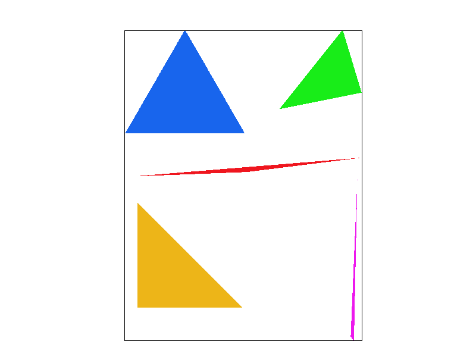  
  1.  <table border=1>
        <tr>
         <td>File</td>
         <td>origin</td>
         <td>-O3</td>
         <td>floodfill</td>
         <td>-O3 and floodfill</td>
        </tr>
        <tr>
          <td> basic.test4</td>
          <td> 0.009137 </td>
          <td> 0.001166 </td>
          <td> 0.013831 </td>
          <td> 0.01215  </td>
        </tr>
        <tr>
          <td> basic.test3</td>
          <td> 0.021364  </td>
          <td> 0.021111  </td>
          <td> 1.21973   </td>
          <td> 1.01984   </td>
        </tr>
      </table>

    
Task2
==============
    
Walk through
------
  1. every call to `fill` of sample_buffer is extended to a size of `width * height * sample_rate`
  1. let `step = sqrt(sample_rate)`, `dd = 1/step`,
     the four lines with `// *!` are different from Task 1 and deal with subpixels

    ``` cpp
    for (int x = xl; x <= xr; ++x) {
			for (int y = yl; y <= yr; ++y) {
				for (int xa = 0; xa < step; ++xa) {     // *!
					for (int ya = 0; ya < step; ++ ya) {  // *!
						if (pt_in_tri(x0, y0, x1, y1, x2, y2, x + xa * dd + half, y + ya * dd + half)) {  // *!
							fill_pixel((size_t)(x * step + xa), (size_t)(y * step + ya), color);   // *!
						}	
					}
				}
			}                 
		}

    ```

  1. in `resolve_to_framebuffer`:
    the square in a size of `sqrt(sample_rate) * sqrt(sample_rate)` will get its average calculated into rgb_frambuffer_target
  1. origin pictures:
  <table>
  <tr>
  <td>

    

  </td>
  <td>

  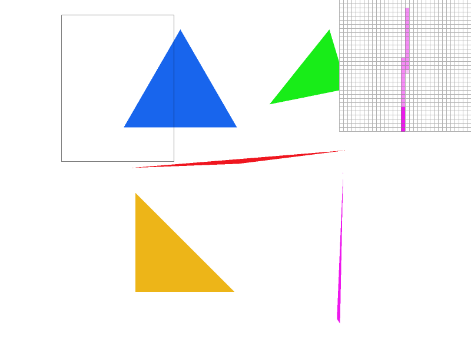  

  </td>
  <td>

    

  </td>
  </tr>
  </table>
  
  1. EXTRA: jittered sampling: (in `resolve_to_framebuffer`, use arbitrary sample(random) to replace the average)
  <table>
  <tr>
  <td>

  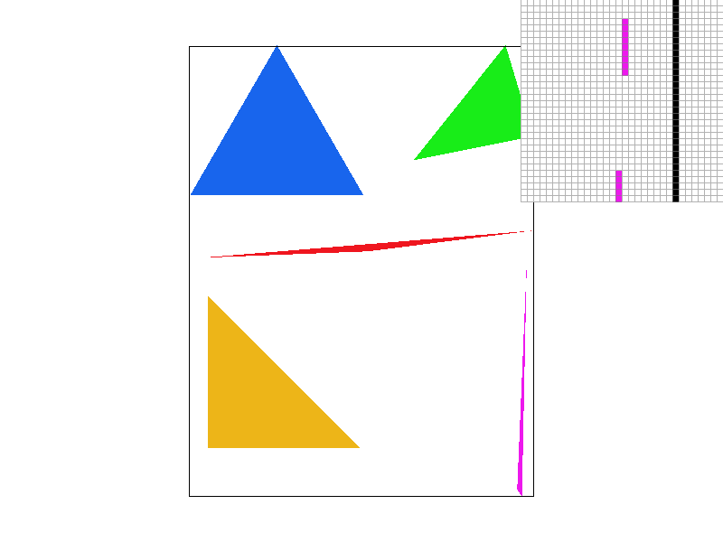  

  </td>
  <td>

  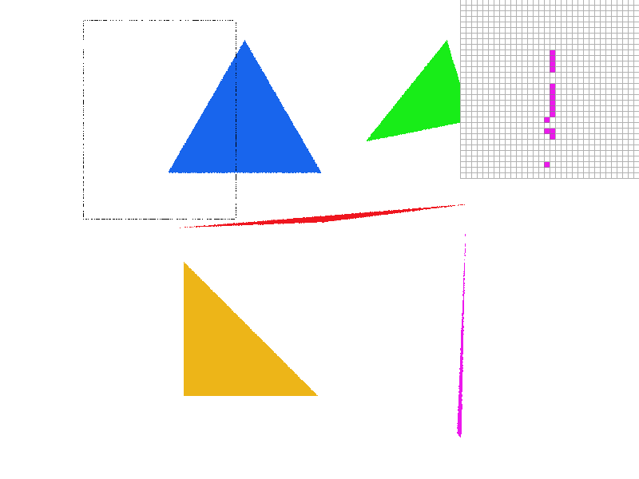  

  </td>
  <td>
  
    
  </td>
  </tr>
  </table>


Task3
========
  The robot is waving his arms like a dancer:
  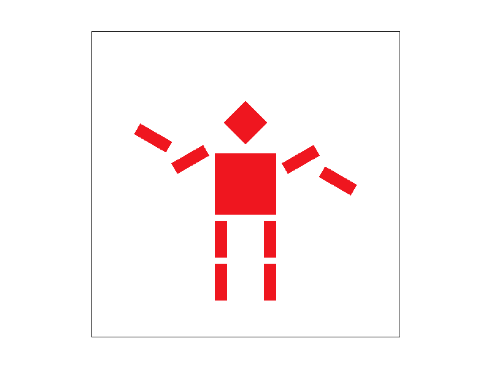

Task4
=======
  1. *Bary center* is the point where the three mid line of a triangle cross each other. *Barycentric coordinate* is a triple(3-tuple) that decribes 
     * how far away a point is from the *Bary center* and the opposite side, to each vertices or 
     * the portion of each triangle area against each of 3 vertices 
     * the linear combination of the point vector out of the three vectors (derived from the three vertices).
  1.   
     every barycentric coordinate (u, v, w) satisfies u + v + w = 1. Specially
  for *Bary center*, the coordinate is (1/3, 1/3, 1/3), 
  [Citation: This image comes from www.scratchpixel.com]
  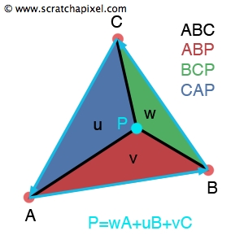
  1.
     the coordinate (u, v, w) can also be used to interpolate other linear stuff like `color` or `texture uv-coordinates`
     This is the key line of my own example:
     ```svg
        <colortri points="0 173.2 100 0  200 173.2" colors="1 0 0 1 0 1 0 1 0 0 1 1 "/>
     ```
     RGB in three vertices are pure red(green or blue), as only one of u, v, w = 1 and the others = 0. The other points have mixed color.

     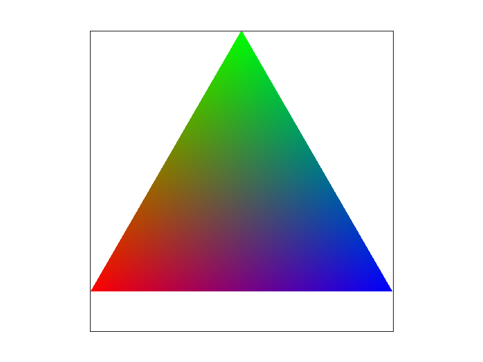

  1.  basic.test7
  


Task 5
========

Walk through
-----------
  1. Based on Task4, but 3 colors are replaced to 3 uv-coordinates. uv-coordinates are calculated using the area portion notation. Take the cited picture again as example:
  

  `w = area(PBC) / area(ABC)`, so is u, v
  Hence we can get `sp.p_uv` by combinate (u, v, w) with given uv-coordinates of A, B, C.

  2. The uv-coordinate  (u, v) may not be an integer.There are two ways to get the color on the texture.
  3. One is to get the nearest point i.e. texcolor(round(u), round(v)).

  4. The other way is to interpolate. Imagine we have only 1d-texture, 
  the coordinate is u. 
  `A, B are integers and corresponding color are CA, CB, A < u < B`
  and
  `u = L * A + (1 - L) * B` 
  We can color u with the computed color `L * CA + (1 - L) * CB`. 

  5. Now we have two dimensions. suppose 
     ```
         U V are integers and U < u < U + 1 and V < v < V + 1
     ```   
     and   
     
     ```
       u = L1 * U + L2 * (U + 1)
       v = L3 * V + L4 * (V + 1)
       where 
       L1 + L2 = 1, 
       L3 + L4 = 1
     ```.
  6. we can color (u, v) with the color 
     ```
       L3 * (L1 * (U, V) + L2 * (U + 1, V)) +
       L4 * (L1 * (U, V + 1) + L2 * (U + 1, V + 1))
     ```
     This is the bilinear interpolation.    

  7. The pictures

     <table border=1>
     <tr>
     <td> Supersampling </td>
     <td> Nearest  </td>
     <td> Bilinear </td>
     </tr>
     <tr>
     <td> 1x </td>
     <td>

     

     </td>

     <td>

     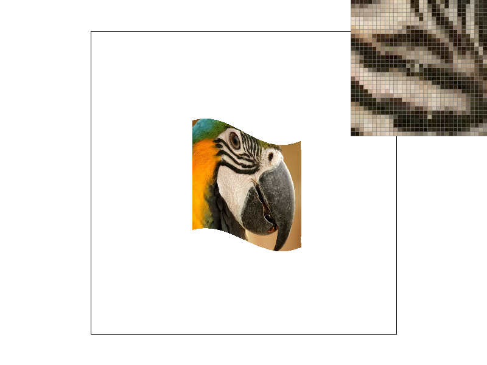

     </td>
     </tr>
     <tr>
     <td> 16x </td>
     <td>

     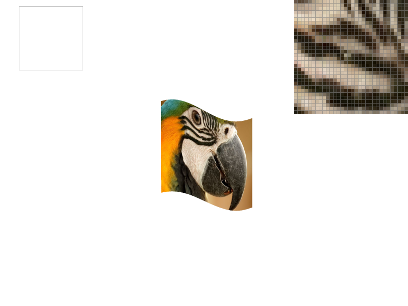

     </td>

     <td>

     

     </td>
     </tr>
     </table>


    1x Nearest have some `noisy` points in the zoom picture, however `16x Nearest` and the two Bilinear use different average method to smooth the points. (Note for average: Bilinear can be seen as a kind of weighted average of nearest four pixels where supersampling is just about average of some 4 subpixels).


Task6
===================== 

  1. A mipmap is a multi-level group of textures that is used to save multiple precision(zoom) of a texture.
  1. `L_ZERO` will always use the basic texture.
  1. The level below refers to the level of details, some uv-coordinate varies faster while some slower while the point travels on the surface.
  1. `L_NEREAST` will use the texture nearest to the given level
  1. `L_LINEAR` will use the two neighbour levels nearest to the 
  given level
  
     * if this gets combined with `P_BILINEAR`, there should be a 3-level linear combination, hence called trilinear.
     * ```cpp
          Color Texture::sample(const SampleParams& sp) {
          if (sp.lsm == L_ZERO) {
            if (sp.psm == P_NEAREST) {
              return sample_nearest(sp.p_uv, 0);	
            } else {
              return sample_bilinear(sp.p_uv, 0);
            }
          }
          float level = mipmap.size() - 1 + get_level(sp);
          level = max(level, 0.0f);
          level = min(level, (float)(mipmap.size() - 1));

          if (sp.lsm == L_NEAREST) {
            int l = (int)round(level);
            if (sp.psm == P_NEAREST) {
              return sample_nearest(sp.p_uv, l);	
            } else {
              return sample_bilinear(sp.p_uv, l);
            }
          } else {
            int ll = (int)floor(level);
            int lr = (int)ceil(level);
            if (ll == lr) {
              if (sp.psm == P_NEAREST) {
                return sample_nearest(sp.p_uv, ll);	
              } else {
                return sample_bilinear(sp.p_uv, ll);
              }	
            } else {
              double lam = 1 - (level - ll) / (lr - ll);
              if (sp.psm == P_NEAREST) {
                return sample_nearest(sp.p_uv, ll) * lam + sample_nearest(sp.p_uv, lr) * (1 - lam); 	
              } else {
                return sample_bilinear(sp.p_uv, ll) * lam + sample_bilinear(sp.p_uv, lr) * (1 - lam);
              }
            }
          }
          
          
          
          return Color(1, 0, 1);
        }


     ```
  1. The result

      <table border=1>
      <tr>
      <td> Pixel | Level </td>
      <td> Level 0 </td>
      <td> Nearest </td>
      <td> Linear </td>
      </tr>
      <tr>
      <td> Nearest </td>
      <td>          

        

      </td>
      <td>
         
        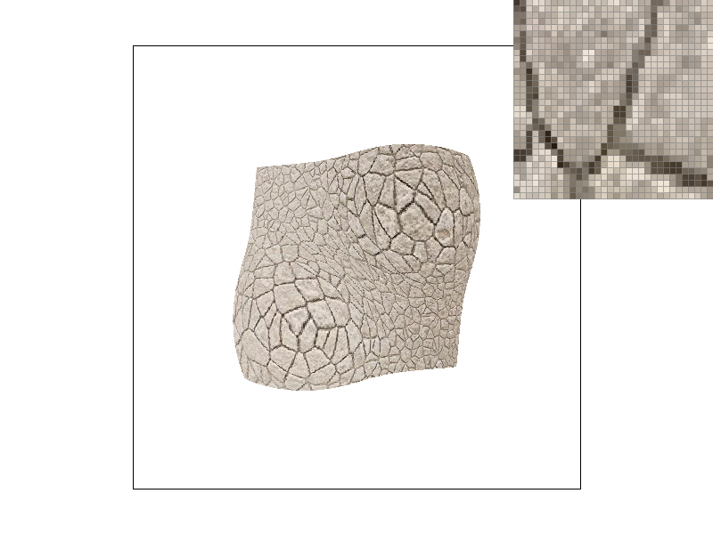 
         
      </td>
      <td>
         
         
         
      </td>
      </tr>
      <tr>
      <td> Bilinear </td>

      <td> 
         
         
         
      </td>
      <td>
         
        
         
      </td>
      <td>
         
        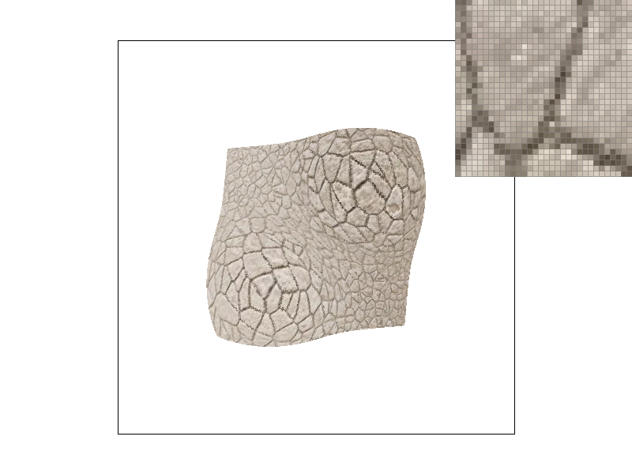 
         
        </td>
      </tr>
      </table>
      <table border=1>
      <tr>
      <td> Pixel | Level (Sumtable used, descibed below)</td>
      <td> Level 0 </td>
      <td> Nearest </td>
      <td> Linear </td>
      </tr>
      <tr>
      <td> Nearest </td>
      <td>          

        

      </td>
      <td>
         
         
         
      </td>
      <td>
         
         
         
      </td>
      </tr>
      <tr>
      <td> Bilinear </td>

      <td> 
         
        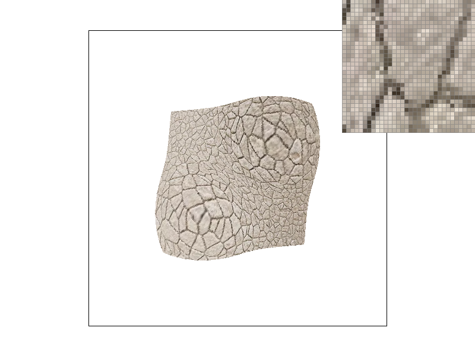 
         
      </td>
      <td>
         
        
         
      </td>
      <td>
         
         
         
        </td>
      </tr>
      </table>
  1. I used sumtable to implement another filter. The idea is
        
          keep a partial sum matrix according to mipmaplevel[0]
          define sumtable.get_texel(tx, ty, dx, dy) as the average color of rectangle
          (tx, ty) - (tx + dx - 1, ty + dy - 1)
          for any level, dx = dy = 2^level or 1 << level
     the changes are:
        1. mip.get_level(tx, ty) changed to sumtable.get_level(tx, ty, 1 << level, 1 << level)
        2. generate_mips will only populate sumtable but not level mip maps
     


Creative
==============
   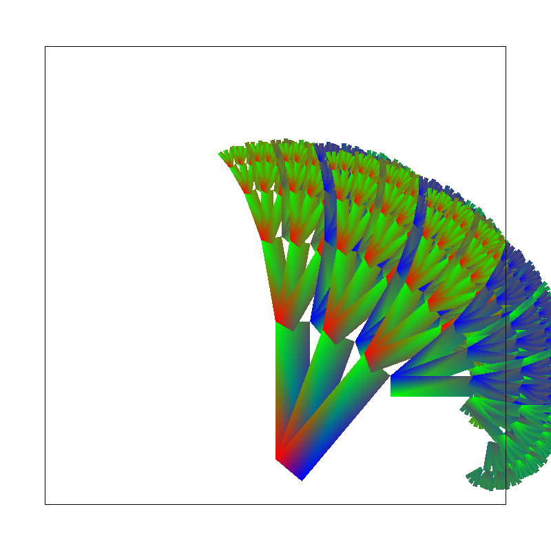
   The code  [colortree.rb](docs/colortree.rb)

  The skeleton comes from svg/subdiv/test1.svg, but only the <svg> header and the format of <colortri> are used.
  Then a recursive procedure is used to generate the plant recursively like a tree, changing the direction and color recursively.

   